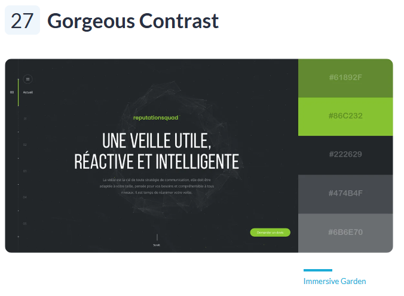
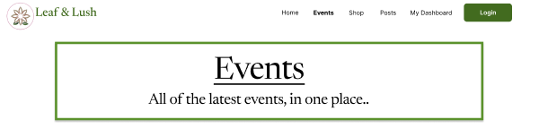
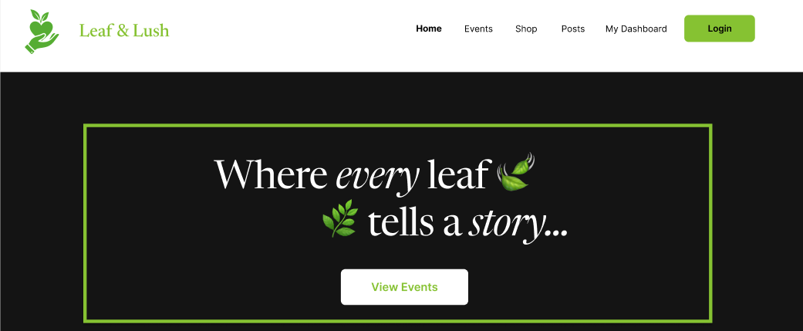
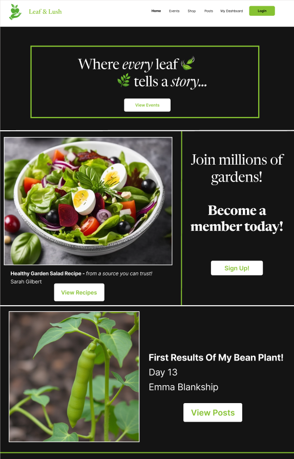
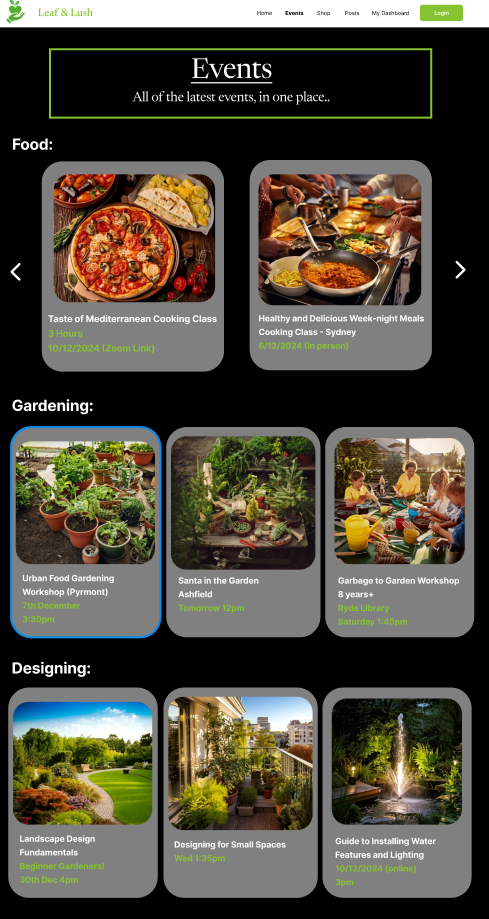
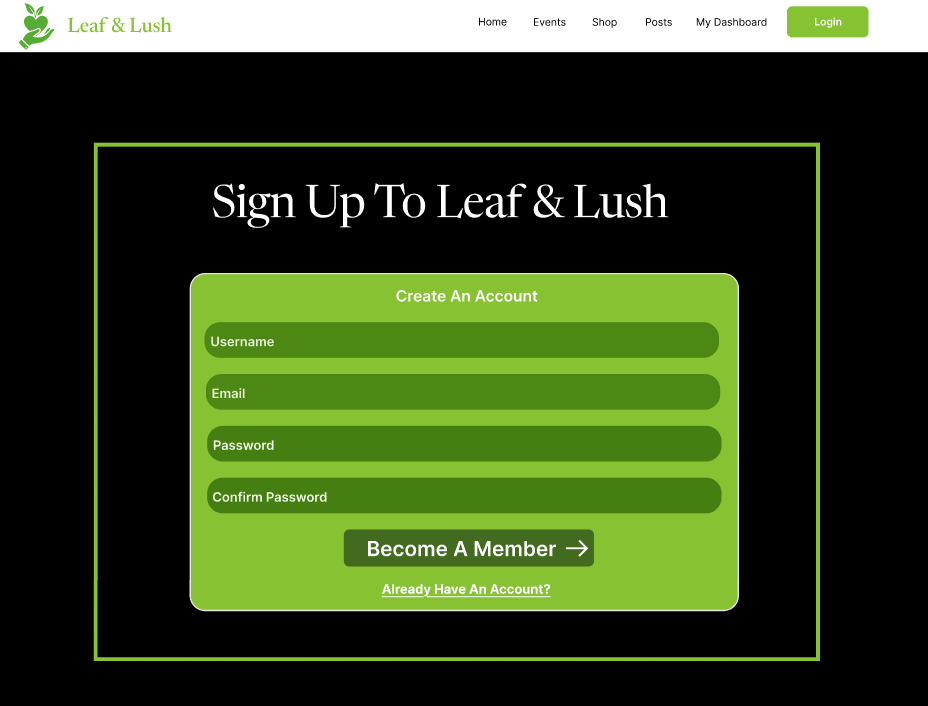
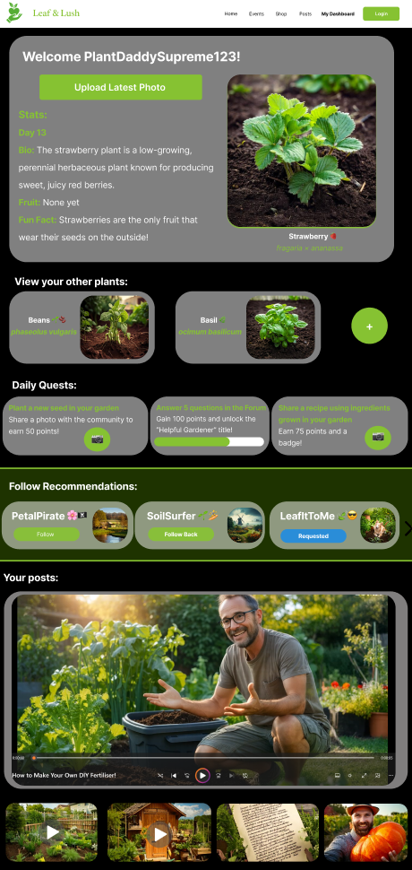
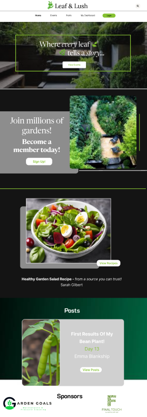
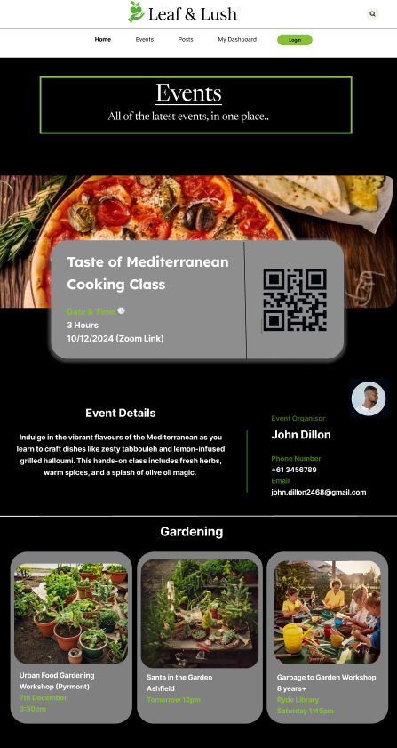

# Project Definition – Leaf & Lush

## Purpose
**Leaf & Lush** is a gardening-themed social networking web application designed to make gardening easy and accessible for young people. It allows users to share tips, post videos, participate in contests, and track plant growth using personal dashboards. Our goal is to create a supportive online gardening community.

## Functional Requirements (What the app will do)
- Users can create an account and log in
- Users can create dashboards for their plants
- Users can post gardening tips, images, and videos
- Users can read newsletters on gardening topics
- Users can enter gardening contests
- Users can complete “quests” (gamified gardening challenges)
- Users can flag/report misinformation
- Admins can approve expert-verified posts

## Non-Functional Requirements (How the app will look & perform)
- Clean and modern UI with earthy colour tones (greens, browns)
- Mobile-friendly and responsive design
- Fast loading (under 3 seconds per page)
- Safe and secure login with multi-factor authentication
- AES-256 encryption for sensitive data
- Regular data backups and use of firewalls
- IDS/IPS monitoring for suspicious activity

## Project Scope
The core features like posting, dashboards, and contests are achievable within 10 weeks. We will start with basic versions of each feature and develop them further if time allows.

## Scope Issues
**Some advanced features such as:**
- Full encryption and security features
- Complex admin/moderation tools  
...may not be completed in full due to the time constraint, but we will include basic mockups or simplified versions.

# Project Task 2  : Basic Design of UI, Hierachy and Interactive Elements  
## Changes
After reviewing the previous UI Design form last year, i decided to change the colour scheme to make it more engaging and visually appealing. 

## My Inspiration:
I beleived that these **contrasting colours** was more effective while still sticking to the **Gardening Theme.**

## Before vs After
The **previous colour pallete** and design seemed to be dull and not catchy to the eye. The logo was also simple and didn't **effectively compliment the website.** 

After implementing new colours, the UI design was much better. 

## Current Design
**Homepage:**

**Events Page:**

**Sign Up Page:**

**Dashboard Page:**

# Project Task 3 - Alternative Design - Playing with Possibilities

## Client Feedback
 - Add an option to change login and profile information
 - Create a more minimalist dsign
 - Create more rounded and smaller buttons
 - Move headings to the centre rather than the side 
 - Add a searchbar icon

## Design Choices
| Design Element   | Choice                                                      |
| ---------------- | ----------------------------------------------------------- |
| Colour Palette   | Garden Green (#86C232), Grey (#474B4F), Jet Black (#000000), White(#FFFFFF) |
| Typography       | Heading: Newsreader, Lexend, Body: Inter                    |
| Image/Icon Style | AI-generated images, Figma Icons & Assets                   |

## Alternative Design Prototype

The Sign-Up Page and Dashboard have a similar layout, however the header is changed to match the other pages.  

**HomePage:**

**Events Page:**

# Project Task 4 - Designing Algorithms

## Flowchart

## Pseudocode
1. User clicks "Add Plant" button
2. Prompt user to upload plant photo
   - If no photo → show error and go back
3. Prompt user to enter:
   - Latin Name
   - Short Bio
   - Fruits Produced? (Yes/No)
   - Fun Fact
4. Validate all fields
   - If missing → show error and go back
5. Save details to database
6. Display new plant card on dashboard

## Test Cases
###  Add Plant to Dashboard

| Test Case ID | Feature Being Tested     | Input                                                                                                                                             | Expected Output                                                  |
|--------------|--------------------------|---------------------------------------------------------------------------------------------------------------------------------------------------|------------------------------------------------------------------|
| TC001        | Add Plant to Dashboard   | **Photo**: rose.jpg, **Latin Name**: *Rosa chinensis*, **Bio**: "A beautiful rose plant", **Fruits**: No, **Fun Fact**: "Symbol of love"           | Plant card appears on dashboard with uploaded image and details |
| TC002        | Add Plant to Dashboard   | **Photo**: _(none)_, **Latin Name**: *Ocimum basilicum*, **Bio**: "Basil plant for cooking", **Fruits**: Yes, **Fun Fact**: "Great in pasta"       | Error message: "Please upload a plant photo"                    |

## Week 5 
This week I started setting up the homepage for the Leaf & Lush website.  
At first, it felt a bit overwhelming because I wasn’t sure how all the files connected together, but once I got the layout and index pages linked, things started to make sense.  
I added a garden image and some placeholder sections just to see how the structure would look. It was really satisfying to finally see the first version of the site come together, even if it was super basic.  

## Week 6 – First Issues  
When I tried to add more features, I ran into a bunch of errors. Images wouldn’t load properly, and some of the links weren’t working.  
I also had a lot of trouble with the navigation bar at the top — it just didn’t want to look the way I imagined.  
I wanted the logo and title in the middle, with the menu links below, but they kept ending up in the wrong place.  
It took a lot of trial and error (and frustration), but eventually I managed to get it closer to what I wanted.  

## Week 7/8 – Making Changes  
After showing my progress, I got some feedback to make the site match the original design more closely.  
I spent time changing the background to black, adding boxes behind text, and stretching sections so they filled the screen properly.  
Some of these changes worked smoothly, but others broke the layout and I had to undo them.  
The homepage slowly started looking more professional, and I was really happy when the garden image finally looked right across the screen.  

## Entry 9 – Recent Progress  
Over the last week, I’ve been refining smaller details.  
I adjusted the “Join millions of gardens!” section so it lined up with the image, added a coloured box behind the text, and made the “Posts” section larger with more space for images and text.  
The sponsor section also looks cleaner now with a white background and bigger logos.  
Not everything worked perfectly the first time, but by testing and adjusting, I’m starting to feel like the homepage is finally coming together the way I pictured it.  
I also started designing and creating the Posts and Event web pages. It's not completely refined and polished at the moment, but some of the elements are starting to come together. 
